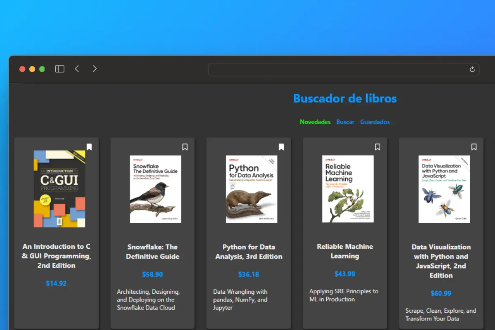

# Search Book App en React

## Ejecutar proyecto

1. Clonar este repositorio: `git clone https://github.com/jmedinalezama/search-book-app.git`
2. Abrir el proyecto en VSCode (recomendado) o editor preferido
3. Instalar dependencias: `npm install`
4. Levantar proyecto: `npm run dev`

<strong>by jmedinalezama 👨‍💻</strong>

